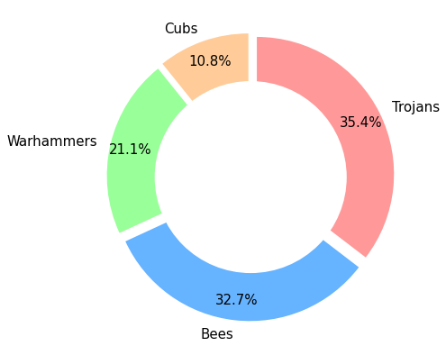

# British Baseball League Ratings

**What is the British Baseball League?**

The British Baseball League is an independent league for amateur baseball teams in the north of England. There are two divisions - the more advanced AAA/AA division of 6 teams and the rookie single-A division of 11 teams. 

In 2022, each team in the single-A division played 24 games in the regular season, with the final division table as shown below.

|Position |Team  | Wins|
--- | --- | ---|
|1|Halton Trojans|22|
|2|Manchester Bees|21|
|3|Wragby Warhammers|18|
|4|Sheffield Cubs|16|
|5|Hull Scorpions|13|
|6|Leeds Locos|10|
|7|Manchester Cs|10|
|8|Halton Twojans|8|
|9|Newcastle Nighthawks 2|6|
|10|Co Durham Spartans|4|
|11|Sheffield Bladerunners 3|3|

There was then a postseason playoff between the top 4 teams, with the Sheffield Cubs coming away victorious.

**Regular season Elo ratings**

Based on the 2022 regular season, the table below shows the Elo ratings (see lower down for details) for the single-A division.

|Position |Team  | Rating|
--- | --- | ---|
|1|Halton Trojans|1690.6|
|2|Manchester Bees|1689.6|
|3|Wragby Warhammers|1637.7|
|4|Sheffield Cubs|1553.5|
|5|Hull Scorpions|1518.3|
|6|Leeds Locos|1478.0|
|7|Manchester Cs|1445.2|
|8|Halton Twojans|1400.1|
|9|Newcastle Nighthawks 2|1399.9|
|10|Co Durham Spartans|1355.0|
|11|Sheffield Bladerunners 3|1332.4|

The ratings give the exact same order as the regular season table, which is reassuring if maybe a bit boring. The ratings do give a little more detail, though. For example:

* Leeds Locos and Manchester Cs finished on the same number of wins, but the ratings show Leeds Locos performed better given who they played.
* Halton Trojans won a game more than Manchester Bees to win the division, but their ratings were pretty similar.
* Halton Twojans won a game more than Newcastle Nighthawks 2, but had almost identical ratings.

**Predicting the postseason**

In the postseason playoffs the top 4 teams compete to be the overall champions. There are two semi-finals (1st v 4th and 2nd v 3rd) followed by a final. Using the probabilites given by their ratings, we can predict who should have been victorious. The chart below shows the predicted winner from 5000 simulated playoffs.

This shows that the Trojans and Bees will be kicking themselves that they didn't come away as overall winners, and that the Cubs overcame pretty big odds to win the playoffs.

**What are Elo ratings?**

Elo ratings are a measure of relative abilities between two teams/individuals. They were first developed by Arpad Elo for ranking chess players, but the system (and extensions to it) have since been applied to many competitive games and sports.

Each team has a rating based on their record. The difference in ratings between two teams gives a probability that one or other team will win: 
* If two teams have the same rating they each have a 50% chance of winning.
* If one team has a rating 100 points higher than the other, the higher-rated team has a 64% chance of winning. 

When two teams play each other, some number of rating points will pass from the loser to the winner. The number of points depends on how likely each team was to win. For example, say team A has a rating 200 points higher than team B, which gives a 76% chance that team A wins. 
* If team A wins, this was completely expected, so only a few points are swapped. 
* If team B causes an upset, more points are swapped since the ratings did a bad job of predicting the outcome.

**Why are these useful?**

Good question. Since we have a league table and playoffs, we already know who the best teams were in 2022 - Halton Trojans won the league and Sheffield Cubs won the playoffs. The ratings still have uses, though. 
* Each team did not play every opponent equally. For example, four teams - Halton Trojans, Halton Twojans, Manchester Bees and Manchester Cs - each played Sheffield Bladerunners 3 four times, but Hull Scorpions and Newcastle Nighthawks 2 never played them. Since the Bladerunners finished bottom of the division, we might suspect this means the former teams had an 'easier' season than the latter. Our ratings will take this into account. 
* We can run the ratings over a longer time-period (as I update the spreadsheet) to get a better picture of which team is best. 
* We can use the probabilities to make predictions on individual games or even the whole season.

