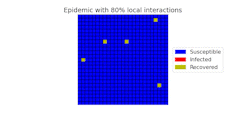
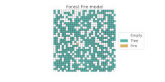

I am a maths lecturer, disease modeller, parent, husband, book-lover, and brass band percussionist.

  
   

  
# Interested in PhD study?

I am always keen to hear from students interested in pursuing PhD study in mathematical modelling. In particular I am likely to offer projects focussed on the spread of disease or pests in forests. The advert below for a previously offered project gives some idea as to the sort of topic I'd offer.
* [PDF version](/PhdAdvert.pdf)
* [Accessible markdown version](/PhdAdvert.md)

# Research

In our group we use mathematical and computational tools to understand the ecology and evolution of infectious diseases. Research questions we have recently addressed include:

* Can we accurately model disease dynamics in forests accounting for localised spread?
* How do seasonal environments impact the evolution of host defence to parasites?
* How does the ratio of 'global' vs 'local' interactions impact disease spread and evolution?

# Teaching

I teach a range of mathematics and statistics modules, mostly focussing on mathematical modelling of real-world problems. You can find materials for recent courses below:

* [MAS377 Mathematical Biology](/mas377/)
* [MAS316 Mathematical Modelling of Natural Systems](/mas316notes) (notes only)

# Equality, diversity and inclusion

I am a passionate advocate for making academia, and mathematics/statistics specifically, a welcoming and inclusive environment. I recognise that many individuals from minoritised groups often feel excluded from academic mathematics, and do not receive the support or recognition given to their peers. I have held Equality, Diversity and Inclusion leadership roles in my School since 2018, and have led a number of activities and policies to promote good practice. Since 2023 I have been co-chair of the [London Mathematical Society's Good Practice Scheme](https://www.lms.ac.uk/women/good-practice-scheme) steering committee, helping to organise events for mathematicians across the country. 

# Public engagement

I regularly give talks at local schools and at University taster days. As part of this I have developed some interactive web apps for use at public engagement and schools outreach events:

* [How do different ocntrol strategie simpact the spread of disease in a forest nursery?](https://abestshef.shinyapps.io/apppy1/))
* [Discover STEM 2022 workshop](https://colab.research.google.com/drive/1qwQCiG0zUrQxmKWLenDXY_QQGN4SL6gi#scrollTo=fQhNbobhg7QC) (Requires a Sheffield GMail account)

Combining my loves of maths (and statistics) and baseball, I have also done a little delving into the world of baseball analytics - or Sabermetrics. I do not consider myself an expert here by any means, but here are some initial analyses I've done of the MLB and my local league.

* [Predicting MLB results and deciding who was the best team in 2023 - attempt 1](/mlb23_pg1)
* [Predicting MLB results and deciding who was the best team in 2023 - attempt 2](/mlb23_pg3)
* [Analysing the 2022 British Baseball League (lower) seasin](/bblratings)

