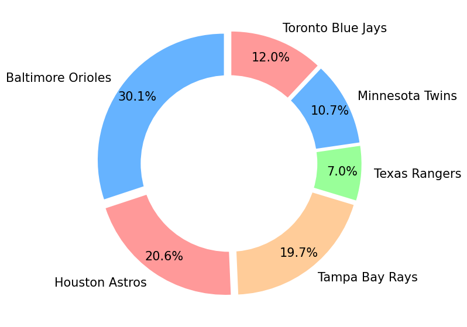
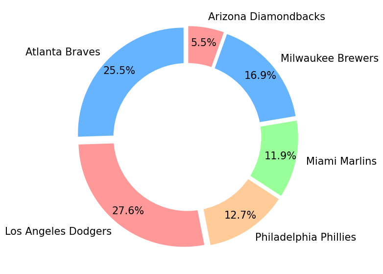

# Predicting baseball results 
# (and settling the debate about who is the best team)

To quote my teammate Rich, baseball is a random sport. Over 162 games, an apparently strong team will have many bad days, while a team derided as a laughing stock may still win up to a third of their games. Yet, come October, we reliably see the best teams reach the post-season and have the chance to become World Series champions. How can we make sense of this? If we're playing in fantasy leagues, how can we decide which teams to choose our players from? And how do we decide who gets the bragging rights to being the best team when they don't play each other equally?

The answers lie in the data, and in probability and statistics. Sabermetrics - the discipline of data analysis in baseball - is a huge field covering all manner of questions and stories. This combines two of my obsessions: my lifelong love of mathematics ([IRL I am a maths lecturer](/index)) and my more recent love affair with baseball.

In these pages I'll cover some entry-level approaches for trying to predict baseball games and decide which teams really are the best. I'll focus on the 2023 MLB season here, [though I have done a small amount of playing around with all this for the league that my own team, the Sheffield Grizzlies, play in](/bblratings).

> **A caveat**
>
> I am not actually a statistician, and this is not an area I actively work in. I am really an enthusiastic amateur who wants to understand how we can use some maths and stats to understand more about what is probably the greatest sport there is. There are many tutorials and explainers available on the internet, some of which I've used myself, and I'll try and link to them as I go along.

So, let's start with probably the simplest approach for making predictions about the outcome of games.

# Elo ratings

The Elo ratings system was initially designed to [rank chess players](https://en.wikipedia.org/wiki/Elo_rating_system), but has since been used widely in other applications, including many sports. The basic algorithm is reasonably straightforward:

---

* All teams are assigned an initial score (usually 1500).
* Before two teams play each other, the probability of each team winning is determined by their respective scores:
    * If the scores are equal, there is a 50% chance of each time winning.
    * Otherwise, the probability is determined from a logistic regression based on the difference between their scores.
* After the result is known, a number of points are transferred from the loser to the winner:
    * If the winner was the higher-ranked team, relatively few points are exchanged as the result was expected.
    * If the winner was the lower-ranked team, rather more points are exchanged, allowing the rankings to 'self-correct'.
 
---

This algorithm is then repeated for every game that takes place. With some thought, it is not too tricky to code this up in Python (other programming languages are available).

Let's take a simple example using the team I support, the San Francisco Giants. After 20 games they had a 7-13 record and an Elo score of 1446 (which we'll call $S_{Giants}$). Their next game was against the New York Mets, who had a rather better 14-8 record and an Elo score of 1546 ($S_{Mets}$). The probability of the Giants winning is then calculated as,

$$\frac{1}{1+10^{(S_{Mets}-S_{Giants})/400}}$$

which gives a 36% chance (and a corresponding 64% chance of a Mets win). In fact, the Giants took a narrow 5-4 victory in this game. The scores of both teams are then updated based on how likely it was for this result to happen.

$$S_{Giants} + 0.64k$$
$$S_{Mets} - 0.64k.$$

The value of $k$ is obviously important here and can be tweaked depending on how sensitive you think the results should be. I take a value of $k=24$ here which seems to work ok, and gives new respective scores of 1461 for the Giants and 1230 for the Mets.

As you can see, then, we could look at any game of our choosing and determine the probabiliy of each team winning based on their past performances. We can also then use the Elo scores to create a ranked list of the teams. While it has no real bearing on anything, for MLB, where teams do not play each other equal times and are divided into 6 different divisions, it is nice to get a sense of who really was the strongest team of the season.

The Elo rankings for the full 2023 season are below, along with the actual games won and win percentage.

|    | Name                  |   Rank |   Games |   GW |      Pct |
|---:|:----------------------|-------:|--------:|-----:|---------:|
|  1 | Milwaukee Brewers     |   1587 |     162 |   92 | 0.567901 |
|  2 | Los Angeles Dodgers   |   1586 |     162 |  100 | 0.617284 |
|  3 | Tampa Bay Rays        |   1582 |     162 |   99 | 0.611111 |
|  4 | Atlanta Braves        |   1581 |     162 |  104 | 0.641975 |
|  5 | Philadelphia Phillies |   1578 |     162 |   90 | 0.555556 |
|  6 | Baltimore Orioles     |   1570 |     162 |  101 | 0.623457 |
|  7 | Miami Marlins         |   1566 |     161 |   84 | 0.521739 |
|  8 | San Diego Padres      |   1565 |     162 |   82 | 0.506173 |
|  9 | Toronto Blue Jays     |   1532 |     162 |   89 | 0.549383 |
| 10 | Detroit Tigers        |   1523 |     162 |   78 | 0.481481 |
| 11 | Minnesota Twins       |   1521 |     162 |   87 | 0.537037 |
| 12 | Pittsburgh Pirates    |   1520 |     162 |   76 | 0.469136 |
| 13 | Houston Astros        |   1520 |     162 |   90 | 0.555556 |
| 14 | Seattle Mariners      |   1516 |     162 |   88 | 0.54321  |
| 15 | New York Yankees      |   1515 |     162 |   82 | 0.506173 |
| 16 | New York Mets         |   1502 |     161 |   74 | 0.459627 |
| 17 | Texas Rangers         |   1495 |     162 |   90 | 0.555556 |
| 18 | Arizona Diamondbacks  |   1492 |     162 |   84 | 0.518519 |
| 19 | St. Louis Cardinals   |   1486 |     162 |   71 | 0.438272 |
| 20 | Chicago Cubs          |   1484 |     162 |   83 | 0.512346 |
| 21 | Cincinnati Reds       |   1479 |     162 |   82 | 0.506173 |
| 22 | Washington Nationals  |   1470 |     162 |   71 | 0.438272 |
| 23 | Kansas City Royals    |   1462 |     162 |   56 | 0.345679 |
| 24 | Cleveland Guardians   |   1450 |     162 |   76 | 0.469136 |
| 25 | San Francisco Giants  |   1428 |     162 |   79 | 0.487654 |
| 26 | Boston Red Sox        |   1420 |     162 |   78 | 0.481481 |
| 27 | Los Angeles Angels    |   1413 |     162 |   73 | 0.450617 |
| 28 | Colorado Rockies      |   1394 |     162 |   59 | 0.364198 |
| 29 | Oakland Athletics     |   1391 |     162 |   50 | 0.308642 |
| 30 | Chicago White Sox     |   1357 |     162 |   61 | 0.376543 |

There are a number of interesting features here. 

1. Who had the Milwaukee Brewers down as the best team of the season? I mean they did well and won their division, but I didn't see them coming out top. This would suggest they had a relatively tough schedule compared to many other teams. In contrast, the Atlanta Braves with their superb 104-win record are only in 4th, suggesting a relatively easy schedule.

2. Down at the other end, the much-maligned Oakland Athletics are *not* the worst ranked team, that dubious honour going to the Chicago White Sox instead (and the Colorado Rockies are only marginally better). Again, this suggests they had a relatively hard schedule to conted with.

3. The World Series eventually took place between the Rangers and the Diamonbacks. They turn out to be the 17th and 18th best teams according to these rankings, suggesting this was a pretty unlikely match-up.

## The post-season

We can dwell on that last point a bit further. Given the teams that made it to the post-season, how likely was it that we ended up with a Rangers-Diamondbacks World Series? From all their respective scores, we can simulate multiple runs of the post-season and see how often these were the two teams to reach the final game from their respective leagues. *I cheated a bit here and asumed each 'round' was a one-off game for ease*. The plots below show the outcome from 10,000 simulated post-seasons.




These show the Rangers had a 7% chance of ending up as American League Division Series champions, and the Diamondbacks just a 5% chance of representing the National League. Since the two are independent, **this gives a 0.385% chance of this World Series occurring at the start of the post-season!**

## Summary

The Elo rankings give us a quick and rough guide of the probability of a team winning a particular game and to then rank the teams overall. It is useful for leagues like MLB where teams don't play each other equally to get a clearer guide as to how well teams are performing. However, it has drawbacks. For one, it only looks at win-loss records and not at the margin of victories. Also, it can be quite sensitive to the $k$-value used. There are updates to this algorithm that can be used such as [Glicko and Glicko-2](https://en.wikipedia.org/wiki/Glicko_rating_system), which incorporate a measure of the reliability of the rating scores (useful particularly if there are periods of inactivity for particular teams/players, which is less of an issue here).

[In the next post, I'll look at how we can make some more detailed predicitons about the actual results of games.](/mlb23_pg3.html)


```python

```
