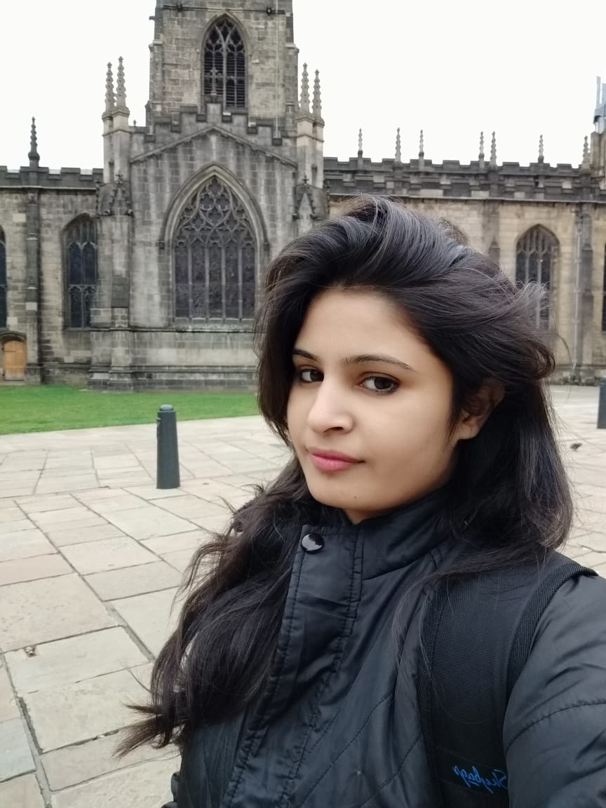
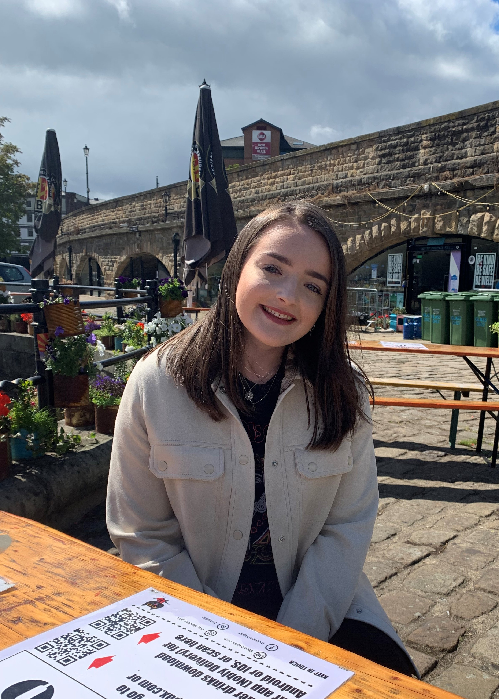

## Alex Best
**Lecturer and group leader**

My research interests cover the dynamics of infectious diseases at a range of biological scales, from the interactions between pathogens and immune cells within hosts, to the population dynamics of ecological populations faced with disease, to the co-evolution of hosts and their parasites. The majority of my time is spent studying the latter of these issues. In particular I am interested in how the evolution of host defences and their coevolution with parasite infectivity feedback to, and are driven by, the underlying population dynamics.

After gaining a BSc in Maths & Philosophy (Durham) and an MRes in Mathematical Biology (York), I studied for my PhD in the Animal & Plant Sciences department at Sheffield under the supervision of Prof. Mike Boots. Postdocs in Sheffield (Animal & Plant Sciences) and Exeter (Biosciences) followed. In 2013 I returned to Sheffield but across the road in the School of Mathematics & Statistics as a Leverhulme Early Career Research Fellow. In September 2016 I was appointed a lecturer.

## Laminu Idris
**PhD student**

*Modelling the Resistance of Anti-microbial (Antibiotics) Treatments by Bacteria through Bet-hedging Strategy*

Studying the dynamics of bacteria, it's treatment(s) and how it used bet-hedging as a strategy to acquire resistance to antibiotics (anti-microbial) treatment(s) rather than other strategies. In this context of bet-hedging, some fractional parts of the bacteria will not take part in the bacterial reproduction, as such they deactivate their metabolism which causes them not to divide and can not be killed by the antibiotic. When treatment is finished or removed, some resistance bacteria can wake up and continue to regrow which will form some nucleus for their reappearance. Possessed a National Diploma in Statistics at "The Federal Polytechnic, P.M.B. 1012, Kaura Namoda, Zamfara State, Nigeria" (1999), First degree in Mathematics/Computer Science (2006) and Second degree in Applied Mathematics (2011) both at "Federal University of Technology, P.M.B. 65, Minna, Niger State, Nigeria". 

## Prerna Singh
**PhD student**

*Host-parasite interactions in fluctuating environments*

My research area consists of the evolution of host-parasite interactions. So, I develop and analyse mathematical models governing the evolutionary dynamics of hosts and parasites in heterogeneous environments. I also study the dynamics of infectious diseases at a range of biological scales. I have obtained my undergraduate degree (BSc) from University of Delhi and masters (MSc) from IIT Madras, India. Apart from that, I have some research expertise in areas related to "e-epidemic modeling". I am really glad to be a part of this amazing research group and the University and hope to make the best out of it. 

## Megan Oliver
**PhD student**

*Host evolution to multiple parasites*

I am researching host-parasite relationships when multiple infection is present. This means that the host can be infected by more than one parasite strain simultaneously and so I will need to develop models that are equipped to handle this. A key area I will explore is to consider how the host may multi-task to overcome these multiple infections. I will also look at trade-offs in the parasites. This captures the idea of striking a balance between overcoming the host defences and outcompeting the co-infecting parasite strains while avoiding the premature death of the host before the parasite has time to transmit. Having gained my undergraduate degree (MMath) at the University of Sheffield I am very happy to be continuing my postgraduate studies here also. 

## Ryan Grossman
**PhD student**
 
*Host-parasite coevolution*

My current research interests focus on population and ecological dynamics of infectious disease systems. In particular, I will be working on the evolutionary modelling of host-parasite associations, concentrating on the coevolution of hosts and their parasites which infect them. Factors I will take into account are, but not limited to, spatial structure, and various trade-offs that arise as a result of the host developing costly resistive strategies against invading parasites.After completing my undergraduate and masters studies in Mathematics at the University of Manchester, I am very happy to join the University of Sheffield, and this great research group. 

# Former students
## Charlotte Ward - PhD Student (2017 - 2020)
*The impact of seasonality on disease dynamics*

Next step: Research ecologist at British Trust for Ornithology

## Caterina Vitale - PhD Student (2016 - 2020)
*The ecology and evolution of host tolerance to disease*

Next step: Graduate job at international consultancy firm

## Charlotte Ferris - PhD Student (2015 - 2019)
*The evolution of host defence in variable environments*

Next step: Trained to become a secondary-school maths teacher.

## Jaspreet Toor - PhD Student (2013 - 2016)
*The evolution of hosts and parasites in complex communities*

Next step: Postdoctoral position at Imperial. 
