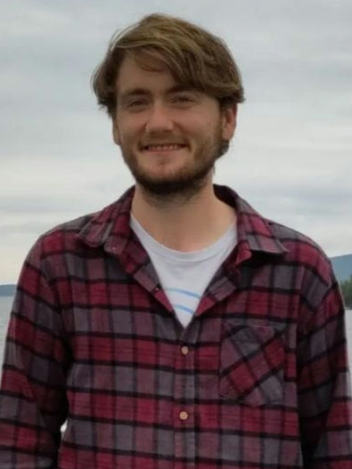

## Alex Best
**Lecturer and group leader**

My research interests cover the dynamics of infectious diseases at a range of biological scales, from the interactions between pathogens and immune cells within hosts, to the population dynamics of ecological populations faced with disease, to the co-evolution of hosts and their parasites. In particular I am interested in how the evolution of host defences and their coevolution with parasite infectivity feedback to, and are driven by, the underlying population dynamics.

After gaining a BSc in Maths & Philosophy (Durham) and an MRes in Mathematical Biology (York), I studied for my PhD in the Animal & Plant Sciences department at Sheffield under the supervision of Prof. Mike Boots. Postdocs in Sheffield (Animal & Plant Sciences) and Exeter (Biosciences) followed. In 2013 I returned to Sheffield but across the road in the School of Mathematics & Statistics as a Leverhulme Early Career Research Fellow. In September 2016 I was appointed a lecturer.

<a href="cv_abest_2021.pdf">Click here for my CV</a>.
[Click here for my Google Scholar page](https://scholar.google.co.uk/citations?user=KVL_a1kAAAAJ&hl=en).

## Megan Oliver
**PhD student**

*Host evolution to multiple parasites*

I am researching host-parasite relationships when multiple infection is present. This means that the host can be infected by more than one parasite strain simultaneously and so I will need to develop models that are equipped to handle this. A key area I will explore is to consider how the host may multi-task to overcome these multiple infections. I will also look at trade-offs in the parasites. This captures the idea of striking a balance between overcoming the host defences and outcompeting the co-infecting parasite strains while avoiding the premature death of the host before the parasite has time to transmit. Having gained my undergraduate degree (MMath) at the University of Sheffield I am very happy to be continuing my postgraduate studies here also. 

## Ryan Grossman
**PhD student**
 
*Host-parasite coevolution*

My current research interests focus on population and ecological dynamics of infectious disease systems. In particular, I will be working on the evolutionary modelling of host-parasite associations, concentrating on the coevolution of hosts and their parasites which infect them. Factors I will take into account are, but not limited to, spatial structure, and various trade-offs that arise as a result of the host developing costly resistive strategies against invading parasites.After completing my undergraduate and masters studies in Mathematics at the University of Manchester, I am very happy to join the University of Sheffield, and this great research group. 

## Charly Pain
**PhD student** *Co-supervised by Ellie Harrison (Biosciences)*

*Rhizobia-legume symbiosis and phage-bacteria co-evolution*

## Jack Woodruff
**PhD student**

*The impacts of spatial structure on the ecology and evolution of infectious disease*

My current research interests focus on spatial structure within infectious disease models. My first area of research will be focusing on vertical transmission, and how this affects host reproductivity within a spatially structured model. During my PhD, I hope to begin to apply spatially structured infectious disease models to forests. Having finished my integrated Masters in Mathematics (York) back in 2020, I am enjoying returning to the study of mathematics.

## Former students

### Prerna Singh - PhD Student (2019 - 2023)
*The evolution and coevolution of host tolerance to arasites*

Next step: Postdoctoral research position at Princeton University.

### Laminu Idris - PhD Student (2017 - 2022)
*Modelling the resistance of bacteria through bet-hedging strategies*

Next step: University teaching post.

### Charlotte Ward - PhD Student (2017 - 2020)
*The impact of seasonality on disease dynamics*

Next step: Research ecologist at British Trust for Ornithology.

### Caterina Vitale - PhD Student (2016 - 2020)
*The ecology and evolution of host tolerance to disease*

Next step: Graduate job at international consultancy firm.

### Charlotte Ferris - PhD Student (2015 - 2019)
*The evolution of host defence in variable environments*

Next step: Trained to become a secondary-school maths teacher.

### Jaspreet Toor - PhD Student (2013 - 2016)
*The evolution of hosts and parasites in complex communities*

Next step: Postdoctoral research position at Imperial College, London. 
